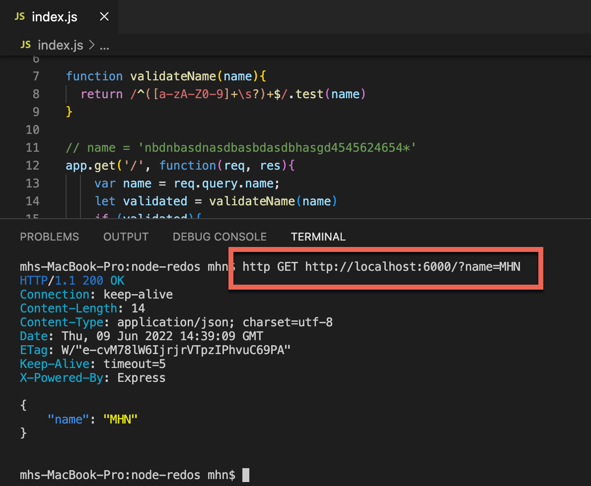
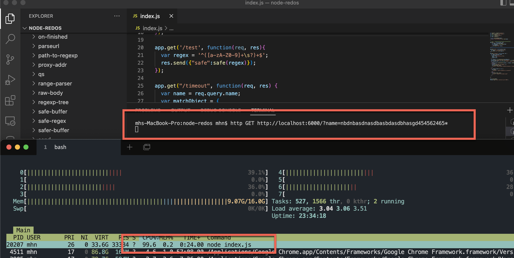
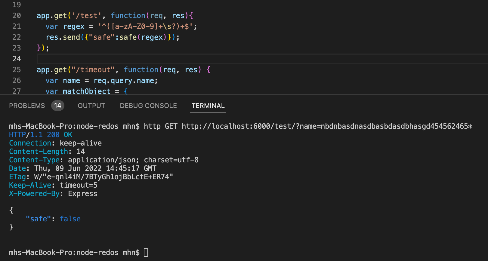
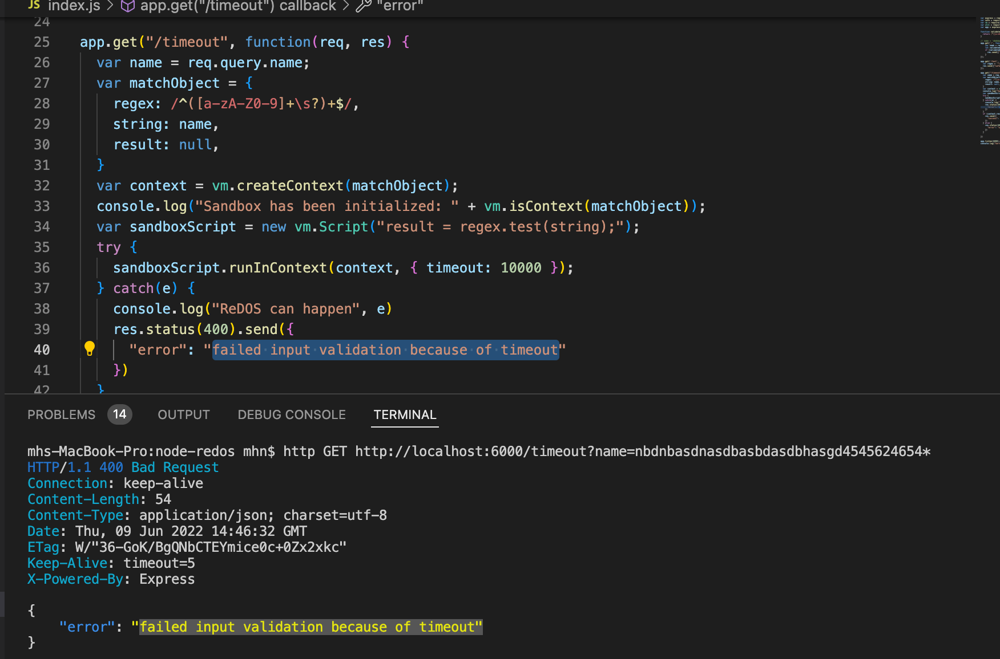

# Nodejs-ReDos

Install necessary dependencies

     npm install

Run the app

     node index.js

Test Vulnerability : 

     http GET http://localhost:5000/?name=MHN

Now try the vulnerable payload

     http GET http://localhost:5000/?name=nbdnbasdnasdbasbdasdbhasgd4545624654*

Now open an other terminal/tab and run htop or activitymonitor

You will see the CPU consumption reaching 100% for the node process

Test whether the payload is safe 

     http GET http://localhost:5000/test/?name=nbdnbasdnasdbasbdasdbhasgd454562465*

It should return the payload as unsafe

# Mitigate ReDOS with Timeout

Now try the previously vulnerable payload

     http GET http://localhost:5000/timeout?name=nbdnbasdnasdbasbdasdbhasgd4545624654*

You should see that the nodejs process times out in 10 seconds (10,000 milliseconds). This is because we've added a timeout to the regex function, that it should not work beyond 10 seconds. 
This is an effective mitigation against ReDOS, aside from adding safer regular expressions to the code.

# Bestway 

Sandbox => The regex test runs inside a Node VM which behaves like a sandbox process that does not impact the global state
Regex timeout => the regex function is set to timeout in 10 seconds (10,000 milliseconds)
References

https://snyk.io/blog/snyking-in-regular-expression-denial-of-service-vulnerability-exploit-in-the-ms-package/

https://www.npmjs.com/package/safe-regex

https://ocaml.org/docs/install.html

https://www.cs.bham.ac.uk/~hxt/research/rxxr2/rxxr2.zip

https://www.cs.bham.ac.uk/~hxt/research/rxxr2/