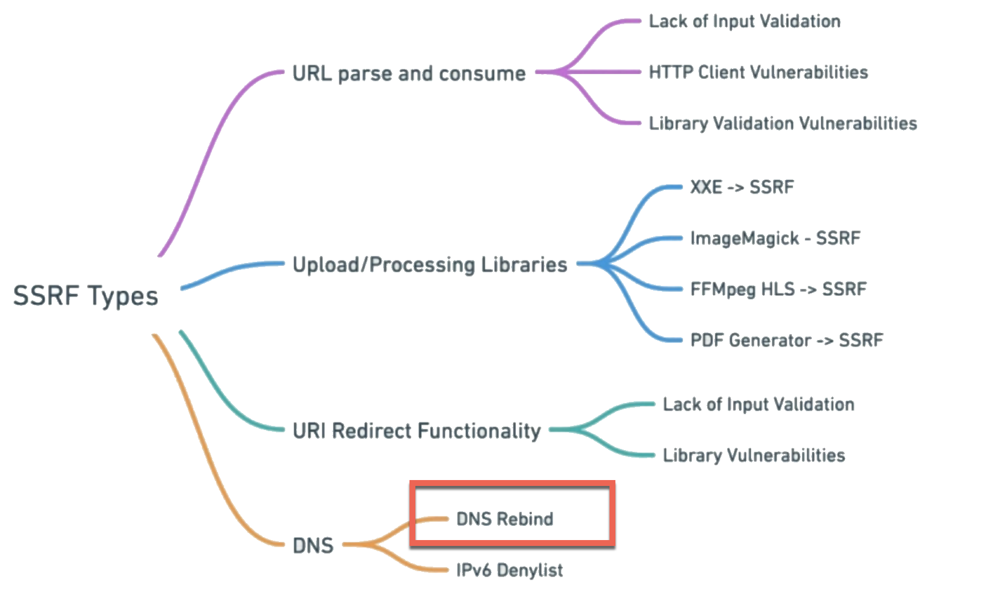
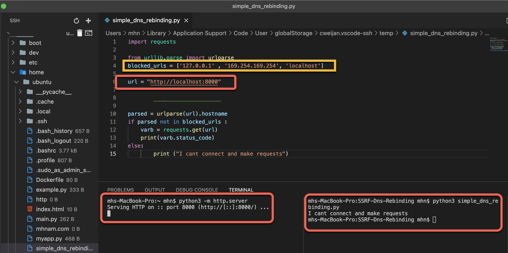
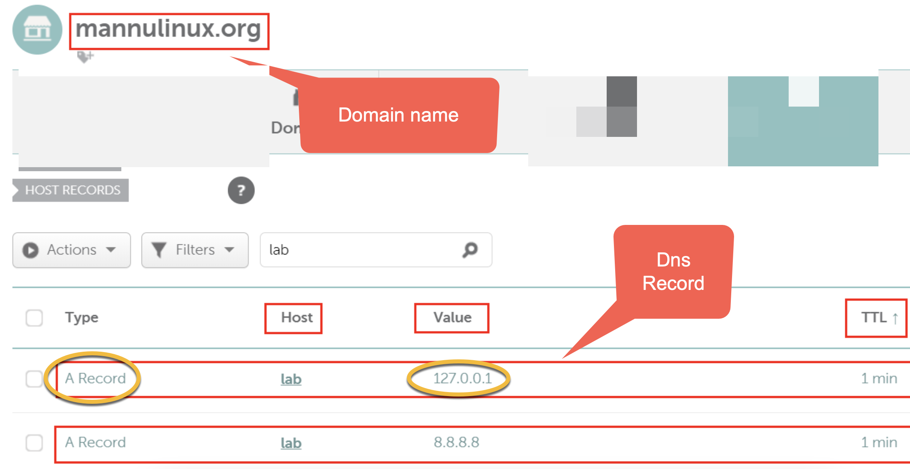
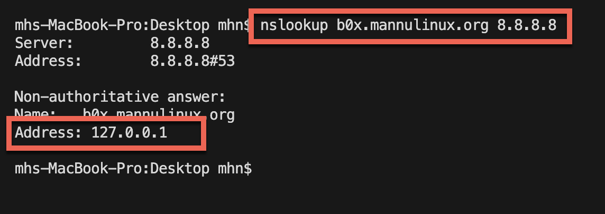
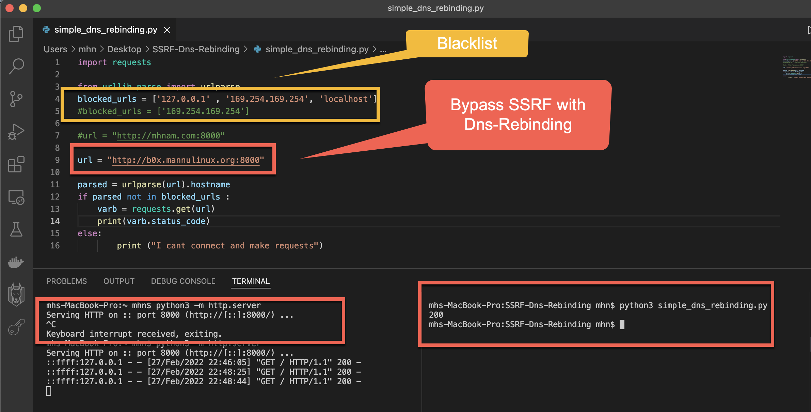

# python-BypassSSRF-With-DnsRebinding-SimpleCode

SSRF flaws occur whenever a web application is fetching a remote resource without validating the user-supplied URL. It allows an attacker to coerce the application to send a crafted request to an unexpected destination, even when protected by a firewall, VPN, or another type of network access control list (ACL).
As modern web applications provide end-users with convenient features, fetching a URL becomes a common scenario. As a result, the incidence of SSRF is increasing. Also, the severity of SSRF is becoming higher due to cloud services and the complexity of architectures.

## Owasp  👑

https://owasp.org/Top10/A10_2021-Server-Side_Request_Forgery_%28SSRF%29/

https://owasp.org/www-community/attacks/Server_Side_Request_Forgery

## SSRF Types

## Concept Attack : 

This is the advanced example of Server-Side Request Forgery (SSRF) attack exploitation. Application code has check for user input data and process if and only domain/IP is not black listed. Attacker need to bypass this protection via DNS rebinding Attack.

## Dns Rebind

When application has implemented black listing of not just internal and private range IPs but also rsolve the user supplied domain to its IP and again perform check if resolved is black listed or not.
In this case, DNS based spoofing trick will also not work to access the content hosted on internal/Reserved IP. Application code perform domain resolution to its IP and again perform black listed IP check for the resolved IP.

## Requirements:

1. SSRF

2. Outbound TLS sessions

3. Stuff on local ports

Attack:
Ask the user/bot access a domain controlled by the attacker The TTL of the DNS is 0 sec (so the victim will check the IP of the domain again soon) A TLS connection is created between the victim and the domain of the attacker. 

## Setup

you can run code on your vps or machine and test this simple code

## Attack step

1. Create simple python code and blocked 127.0.0.1 & 169.254.169.254 & localhost request
2. start python httpserver
3. run python code that the answer is I can't connect and make request because the the code run on 127.0.0.1 

4. we want to bypass this with dnsrebinding 
5. we want to add a record to one of domain 
such as 8.8.8.8 and 127.0.0.1

6. we can run this command fot test 

        nslookup b0x.mannulinux.org 8.8.8.8

7. now, we change the address to b0x.mannulinux.org
and we received to 200 status code because b0x.mannulinux.org resolved to 127.0.0.1 and we can bypass SSRF restrictions with DNS rebinding

## Hint for TTL  👻 💀 ☠️

1. Ask the user/bot access a domain controlled by the attacker
2. The TTL of the DNS is 0 sec (so the victim will check the IP of the domain again soon)
3. A TLS connection is created between the victim and the domain of the attacker. The attacker introduces the payload inside the Session ID

and When user specify the web application sub-domain entry, user can specify the "TTL" value atleast 1 minute. This attribute instruct web server or browser that the resolved IP for the Domain will be valid of this time period only and need to make another DNS request when domain need to be accessed.

Here, attacker will configure the both the IPs of Sub-Domain/Domain with "TTL" 1 minute. Now, DNS will server different-2 IP when web server is going to make request after difference of 1 minute due to the "TTL" and 2 IPs binded to it.

## Attack Automation 

Automated DNS Rebidding
Singularity of Origin is a tool to perform DNS rebinding attacks. It includes the necessary components to rebind the IP address of the attack server DNS name to the target machine's IP address and to serve attack payloads to exploit vulnerable software on the target machine.
Check out also the publicly running server in  : http://rebind.it/singularity.html

## Attack & Fix Guide :  

DEFCONConference attack : https://www.youtube.com/watch?v=qGpAJxfADjo&feature=emb_title

https://github.com/FSecureLABS/dref

## Twitter & Facebook Contributor :
   
 https://www.linkedin.com/in/mohammad-hussein-namadi-775baa131/
     
## Fix 

We encourage you to contribute to Project and Fix Codes

If you want to pull request please follow this :

CONTRIBUTION.md

## Report Example

1. https://hackerone.com/reports/632101
2. https://hackerone.com/reports/530974
3. https://r0.haxors.org/posts?id=13
4. https://ahermosilla.com/security/2020/06/04/sneaky-dns-ssrf.html
5. https://www.youtube.com/watch?v=90AdmqqPo1Y
6. https://medium.com/bugbountywriteup/dns-rebinding-the-treacherous-attack-it-can-be-b367c61b4372
7. https://geleta.eu/2019/my-first-ssrf-using-dns-rebinfing
8. https://jinone.github.io/bugbounty-a-simple-ssrf/
9. https://infosecwriteups.com/dns-rebinding-the-treacherous-attack-it-can-be-b367c61b4372
10. https://hackerone.com/reports/530974

 

