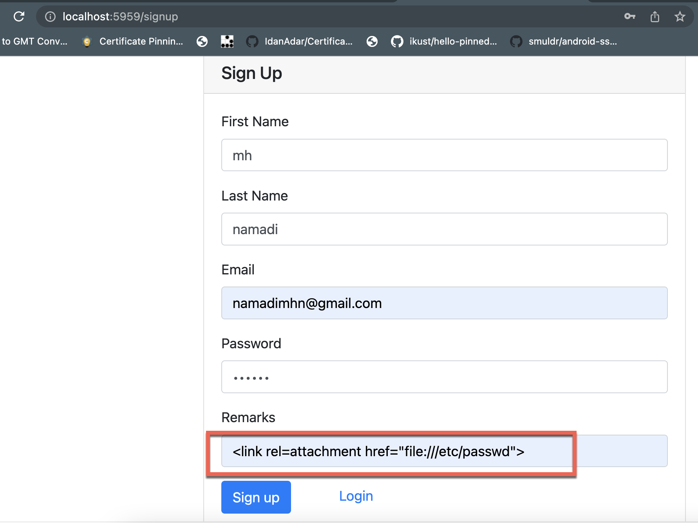
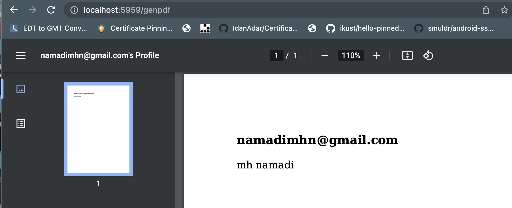
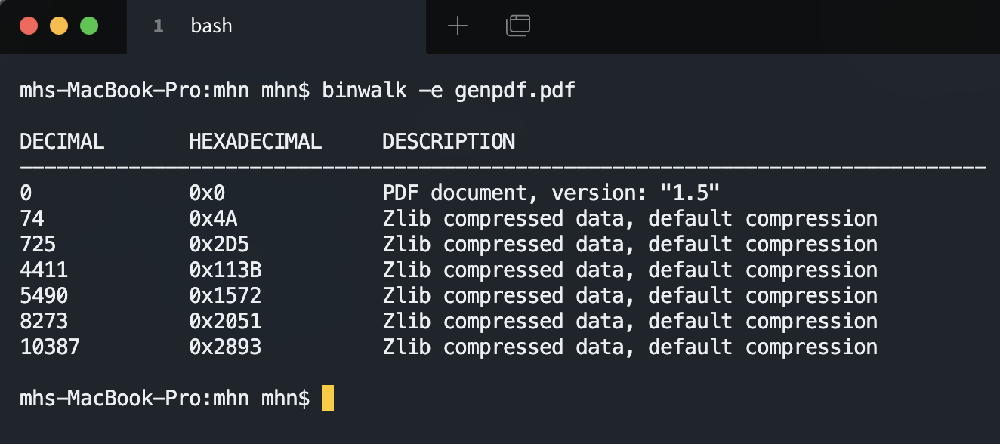
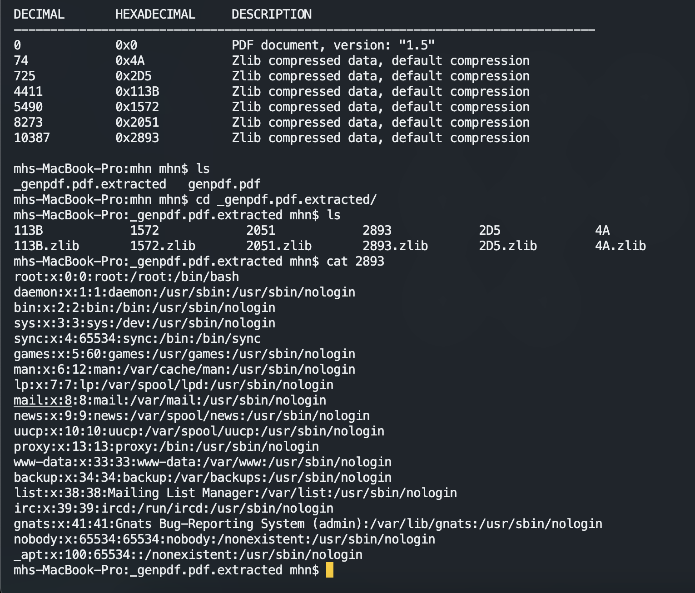

# python-flask-ssrfpdf-to-lfi

SSRF flaws occur whenever a web application is fetching a remote resource without validating the user-supplied URL. It allows an attacker to coerce the application to send a crafted request to an unexpected destination, even when protected by a firewall, VPN, or another type of network access control list (ACL).
As modern web applications provide end-users with convenient features, fetching a URL becomes a common scenario. As a result, the incidence of SSRF is increasing. Also, the severity of SSRF is becoming higher due to cloud services and the complexity of architectures.

## Owasp

https://owasp.org/Top10/A10_2021-Server-Side_Request_Forgery_%28SSRF%29/

https://owasp.org/www-community/attacks/Server_Side_Request_Forgery

## SAST Tools : 

Find With SAST Tools : Soon

## Setup

install from my dockerhub : https://hub.docker.com/r/mhnamadi/ssrfpdf

    docker run -itd -p 5959:5000 mhnamadi/ssrfpdf

## Payload 

    <link rel=attachment href="file:///etc/passwd">

## Attack

1 . Signup With Payload

2 . Login

3 . Generate PDF

4 . Using binwalk

## Fix Guide :  

Developers can prevent SSRF by implementing some or all the following defense in depth controls:

From Network layer :  

    Segment remote resource access functionality in separate networks to reduce the impact of SSRF

    Enforce “deny by default” firewall policies or network access control rules to block all but essential intranet traffic.

## Hints:

    Establish an ownership and a lifecycle for firewall rules based on applications.

    Log all accepted and blocked network flows on firewalls (see A09:2021-Security Logging and Monitoring Failures)

## Twitter & Facebook Contributor :
   
 https://www.linkedin.com/in/mohammad-hussein-namadi-775baa131/
 
 https://twitter.com/siavashvafshar
    
## Fix 

We encourage you to contribute to Project and Fix Codes

If you want to pull request please follow this :

CONTRIBUTION.md

## Report Example

1. [My Expense Report resulted in a Server-Side Request Forgery (SSRF) on Lyft](https://hackerone.com/reports/885975) to Lyft - 587 upvotes, $0
2. [SSRF in Exchange leads to ROOT access in all instances](https://hackerone.com/reports/341876) to Shopify - 507 upvotes, $25000
3. [Server Side Request Forgery (SSRF) at app.hellosign.com leads to AWS private keys disclosure](https://hackerone.com/reports/923132) to Dropbox - 357 upvotes, $4913
4. [Server-Side Request Forgery using Javascript allows to exfill data from Google Metadata](https://hackerone.com/reports/530974) to Snapchat - 344 upvotes, $4000
5. [SSRF & LFR via on city-mobil.ru](https://hackerone.com/reports/748123) to Mail.ru - 338 upvotes, $6000
6. [SSRF on project import via the remote_attachment_url on a Note](https://hackerone.com/reports/826361) to GitLab - 337 upvotes, $10000
7. [Server Side Request Forgery mitigation bypass](https://hackerone.com/reports/632101) to GitLab - 330 upvotes, $3500
8. [SSRF on fleet.city-mobil.ru leads to local file read](https://hackerone.com/reports/748069) to Mail.ru - 272 upvotes, $6000
9. [SSRF  leaking internal google cloud data through upload function [SSH Keys, etc..]](https://hackerone.com/reports/549882) to Vimeo - 242 upvotes, $5000
10. [SSRF & LFR on city-mobil.ru](https://hackerone.com/reports/748128) to Mail.ru - 237 upvotes, $6000
11. [Unsafe charts embedding implementation leads to cross-account stored XSS and SSRF](https://hackerone.com/reports/708589) to New Relic - 222 upvotes, $2500
12. [Unauthenticated blind SSRF in OAuth Jira authorization controller](https://hackerone.com/reports/398799) to GitLab - 216 upvotes, $4000
13. [Full read SSRF in www.evernote.com that can leak aws metadata and local file inclusion](https://hackerone.com/reports/1189367) to Evernote - 215 upvotes, $5000
14. [Unauthenticated SSRF in jira.tochka.com leading to RCE in confluence.bank24.int](https://hackerone.com/reports/713900) to QIWI - 213 upvotes, $1000
15. [Full Read SSRF on Gitlab's Internal Grafana](https://hackerone.com/reports/878779) to GitLab - 200 upvotes, $12000
16. [Full Response SSRF via Google Drive](https://hackerone.com/reports/1406938) to Dropbox - 197 upvotes, $17576
17. [SSRF in webhooks leads to AWS private keys disclosure](https://hackerone.com/reports/508459) to Omise - 190 upvotes, $700
18. [Stored XSS & SSRF in Lark Docs](https://hackerone.com/reports/892049) to Lark Technologies - 168 upvotes, $3000
19. [SSRF on duckduckgo.com/iu/](https://hackerone.com/reports/398641) to DuckDuckGo - 155 upvotes, $0
20. [Server Side Request Forgery](https://hackerone.com/reports/644238) to Lark Technologies - 153 upvotes, $1500
21. [External SSRF and Local File Read via video upload due to vulnerable FFmpeg HLS processing](https://hackerone.com/reports/1062888) to TikTok - 137 upvotes, $2727
22. [SSRF in clients.city-mobil.ru](https://hackerone.com/reports/712103) to Mail.ru - 132 upvotes, $1500
23. [Blind SSRF on errors.hackerone.net due to Sentry misconfiguration](https://hackerone.com/reports/374737) to HackerOne - 130 upvotes, $3500
24. [SSRF in filtering on relap.io](https://hackerone.com/reports/739962) to Mail.ru - 129 upvotes, $1700
25. [SSRF chained to hit internal host leading to another SSRF which allows to read internal images.](https://hackerone.com/reports/826097) to PlayStation - 129 upvotes, $1000
26. [SSRF on music.line.me through getXML.php](https://hackerone.com/reports/746024) to LINE - 128 upvotes, $4500
27. [SSRF In Get Video Contents](https://hackerone.com/reports/643622) to Semrush - 114 upvotes, $500
28. [XXE Injection through SVG image upload leads to SSRF](https://hackerone.com/reports/897244) to Zivver - 110 upvotes, $0
29. [[city-mobil.ru] SSRF & limited LFR on /taxiserv/photoeditor/save endpoint via base64 POST parameter](https://hackerone.com/reports/853068) to Mail.ru - 94 upvotes, $6000
30. [SSRF on image renderer](https://hackerone.com/reports/811136) to PlayStation - 92 upvotes, $1000
31. [Full read SSRF via Lark Docs `import as docs` feature ](https://hackerone.com/reports/1409727) to Lark Technologies - 91 upvotes, $5000
32. [Blind SSRF in horizon-heat](https://hackerone.com/reports/893856) to Mail.ru - 91 upvotes, $2500
33. [SSRF in api.slack.com, using slash commands and bypassing the protections.](https://hackerone.com/reports/381129) to Slack - 78 upvotes, $500
34. [SSRF and LFI in site-audit tool](https://hackerone.com/reports/794099) to Semrush - 77 upvotes, $2000
35. [SSRF на https://qiwi.com с помощью "Prerender HAR Capturer"](https://hackerone.com/reports/1153862) to QIWI - 76 upvotes, $1500
36. [Blind SSRF in emblem editor (2)](https://hackerone.com/reports/265050) to Rockstar Games - 72 upvotes, $1500
37. [SSRF in CI after first run](https://hackerone.com/reports/369451) to GitLab - 69 upvotes, $3000
38. [LFI and SSRF via XXE in emblem editor](https://hackerone.com/reports/347139) to Rockstar Games - 68 upvotes, $1500
39. [Sending Emails from  DNSDumpster - Server-Side Request Forgery to Internal SMTP Access](https://hackerone.com/reports/392859) to Hacker Target - 68 upvotes, $0
40. [SVG Server Side Request Forgery (SSRF)](https://hackerone.com/reports/223203) to Shopify - 65 upvotes, $500
41. [Blind SSRF on debug.nordvpn.com due to misconfigured sentry instance](https://hackerone.com/reports/756149) to Nord Security - 63 upvotes, $100
42. [GitLab::UrlBlocker validation bypass leading to full Server Side Request Forgery](https://hackerone.com/reports/541169) to GitLab - 62 upvotes, $5000
43. [[SSRF] Server-Side Request Forgery at https://sea-web.gold.razer.com/dev/simulator via notify_url Parameter](https://hackerone.com/reports/777664) to Razer - 60 upvotes, $2000
44. [SSRF and local file disclosure by video upload on https://www.redtube.com/upload](https://hackerone.com/reports/570537) to Redtube - 60 upvotes, $500
45. [Blind SSRF on https://labs.data.gov/dashboard/Campaign/json_status/ Endpoint](https://hackerone.com/reports/895696) to GSA Bounty - 58 upvotes, $300
46. [SSRF with information disclosure](https://hackerone.com/reports/810401) to Lark Technologies - 57 upvotes, $550
47. [SSRF and local file disclosure in https://wordpress.com/media/videos/ via FFmpeg HLS processing](https://hackerone.com/reports/237381) to Automattic - 56 upvotes, $800
48. [Blind SSRF in magnum upgrade_params](https://hackerone.com/reports/907819) to Mail.ru - 54 upvotes, $2500
49. [[tanks.mail.ru] SSRF + Кража cookie ](https://hackerone.com/reports/1166943) to Mail.ru - 54 upvotes, $750
50. [SSRF and local file disclosure by video upload on https://www.tube8.com/](https://hackerone.com/reports/574133) to Tube8 - 53 upvotes, $500
51. [Get-based SSRF limited to HTTP protocol on https://resizer.line-apps.com/form](https://hackerone.com/reports/707014) to LINE - 50 upvotes, $1350
52. [FogBugz import attachment full SSRF requiring vulnerability in *.fogbugz.com](https://hackerone.com/reports/1092230) to GitLab - 49 upvotes, $6000
53. [SSRF - Unchecked Snippet IDs for distributed files](https://hackerone.com/reports/997926) to Open-Xchange - 49 upvotes, $1500
54. [BLIND SSRF ON http://jsgames.mail.ru via avaOp parameter ](https://hackerone.com/reports/1043801) to Mail.ru - 49 upvotes, $1200

