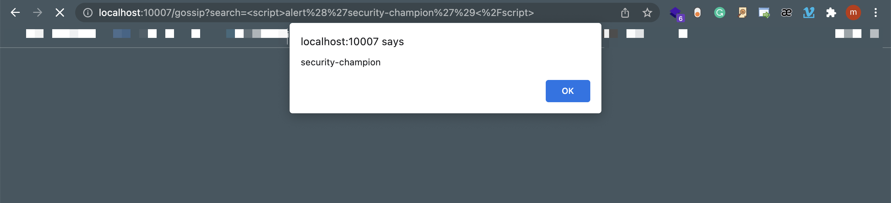

# Python-Flask-XSS-2

simple Flask app that contains an example of multiple Injection (XSS) vulnerabilities and its main goal is to describe how a malicious user could exploit them on this purposefully vulnerable app.

## What is Cross-Site Scripting?

XSS flaws occur whenever an application includes untrusted data in a new web page without proper validation or escaping, or updates an existing web page with user-supplied data using a browser API that can create HTML or JavaScript. XSS allows attackers to execute scripts in the victim’s browser which can hijack user sessions, deface web sites, or redirect the user to malicious sites.

Owasp : https://owasp.org/www-community/attacks/xss/

## Setup

      make install

Then simply visit [localhost:10007][app] ! 😆

## SAST

Find With SAST Tools : SonarQube Develpoer

Find With My yml template : 

          pattern-regex: "{{.*?\\|\\s*safe(\\s*}})?"

## Attack Hint 

## Fix Hint

https://flask.palletsprojects.com/en/1.1.x/templating/#controlling-autoescaping
   
## Twitter & Facebook Contributor :
   
 https://www.linkedin.com/in/mohammad-hussein-namadi-775baa131/
 
 https://twitter.com/siavashvafshar
    
## Fix 

We encourage you to contribute to Project and Fix Codes

If you want to pull request please follow this :

CONTRIBUTION.md

## Sample Report
Top XSS reports from HackerOne:

1. [Bypass for #488147 enables stored XSS on https://paypal.com/signin again](https://hackerone.com/reports/510152) to PayPal - 2520 upvotes, $20000
2. [Stored XSS on https://paypal.com/signin via cache poisoning](https://hackerone.com/reports/488147) to PayPal - 639 upvotes, $18900
3. [Reflected XSS on https://www.glassdoor.com/employers/sem-dual-lp/](https://hackerone.com/reports/846338) to Glassdoor - 630 upvotes, $1000
4. [Stored XSS in Wiki pages](https://hackerone.com/reports/526325) to GitLab - 594 upvotes, $4500
5. [Stored XSS on imgur profile](https://hackerone.com/reports/484434) to Imgur - 589 upvotes, $650
6. [Reflected XSS in OAUTH2 login flow ](https://hackerone.com/reports/697099) to LINE - 466 upvotes, $1989
7. [XSS in steam react chat client](https://hackerone.com/reports/409850) to Valve - 448 upvotes, $7500
8. [Cross-Site-Scripting on www.tiktok.com and m.tiktok.com leading to Data Exfiltration](https://hackerone.com/reports/968082) to TikTok - 448 upvotes, $3860
9. [XSS vulnerable parameter in a location hash](https://hackerone.com/reports/146336) to Slack - 438 upvotes, $1100
10. [Panorama UI XSS leads to Remote Code Execution via Kick/Disconnect Message](https://hackerone.com/reports/631956) to Valve - 406 upvotes, $9000
11. [Blind XSS on image upload](https://hackerone.com/reports/1010466) to CS Money - 397 upvotes, $1000
12. [Stored XSS Vulnerability](https://hackerone.com/reports/643908) to WordPress - 389 upvotes, $500
13. [Reflected XSS and sensitive data exposure, including payment details, on lioncityrentals.com.sg](https://hackerone.com/reports/340431) to Uber - 366 upvotes, $4000
14. [Stored XSS in wordpress.com](https://hackerone.com/reports/733248) to Automattic - 346 upvotes, $650
15. [HEY.com email stored XSS](https://hackerone.com/reports/982291) to Basecamp - 344 upvotes, $5000
16. [Reflected XSS on www.hackerone.com and resources.hackerone.com](https://hackerone.com/reports/840759) to HackerOne - 344 upvotes, $500
17. [Reflected XSS in TikTok endpoints](https://hackerone.com/reports/1350887) to TikTok - 332 upvotes, $4500
18. [Stored XSS in Private Message component (BuddyPress)](https://hackerone.com/reports/487081) to WordPress - 331 upvotes, $500
19. [Blind XSS on Twitter's internal Big Data panel at █████████████](https://hackerone.com/reports/1207040) to Twitter - 330 upvotes, $5040
20. [XSS while logging using Google](https://hackerone.com/reports/691611) to Shopify - 323 upvotes, $1750
21. [Stored XSS in my staff name fired in another your internal panel](https://hackerone.com/reports/946053) to Shopify - 315 upvotes, $5000
22. [DOM XSS on duckduckgo.com search](https://hackerone.com/reports/868934) to DuckDuckGo - 314 upvotes, $0
23. [Reflected XSS](https://hackerone.com/reports/739601) to Bumble - 313 upvotes, $1000
24. [Reflected XSS at https://pay.gold.razer.com escalated to account takeover](https://hackerone.com/reports/723060) to Razer - 287 upvotes, $750
25. [Cross-site Scripting (XSS) - Stored in RDoc wiki pages](https://hackerone.com/reports/662287) to GitLab - 274 upvotes, $3500
26. [Unrestricted file upload leads to Stored XSS](https://hackerone.com/reports/808862) to Visma Public - 268 upvotes, $250
27. [Persistent XSS on keybase.io via "payload" field in `/user/sigchain_signature.toffee` template](https://hackerone.com/reports/245296) to Keybase - 265 upvotes, $3000
28. [Stored XSS in markdown via the DesignReferenceFilter ](https://hackerone.com/reports/1212067) to GitLab - 263 upvotes, $16000
29. [Account takeover through the combination of cookie manipulation and XSS](https://hackerone.com/reports/534450) to Grammarly - 251 upvotes, $2000
30. [Arbitrary File Upload to Stored XSS](https://hackerone.com/reports/808821) to Visma Public - 245 upvotes, $250
31. [Stored xss in address field in billing activity at https://shop.aaf.com/Order/step1/index.cfm](https://hackerone.com/reports/411690) to Alliance of American Football  - 235 upvotes, $1500
32. [XSS via Direct Message deeplinks](https://hackerone.com/reports/341908) to Twitter - 225 upvotes, $2940
33. [XSS and Open Redirect on MoPub Login](https://hackerone.com/reports/683298) to Twitter - 225 upvotes, $1540
34. [Unsafe charts embedding implementation leads to cross-account stored XSS and SSRF](https://hackerone.com/reports/708589) to New Relic - 222 upvotes, $2500
35. [Cross-site Scripting (XSS) on HackerOne careers page](https://hackerone.com/reports/474656) to HackerOne - 222 upvotes, $500
36. [Reflected XSS on www.hackerone.com via Wistia embed code](https://hackerone.com/reports/986386) to HackerOne - 221 upvotes, $500
37. [[panel.city-mobil.ru/admin/] Blind XSS into username](https://hackerone.com/reports/746505) to Mail.ru - 219 upvotes, $750
38. [[www.zomato.com] Blind XSS on one of the Admin Dashboard](https://hackerone.com/reports/724889) to Zomato - 211 upvotes, $750
39. [Stored XSS in developer.uber.com](https://hackerone.com/reports/131450) to Uber - 208 upvotes, $7500
40. [XSS At "pages.et.uber.com"](https://hackerone.com/reports/156098) to Uber - 205 upvotes, $0
41. [Stored XSS on reports.](https://hackerone.com/reports/485748) to Twitter - 197 upvotes, $700
42. [Ability to create own account UUID leads to stored XSS](https://hackerone.com/reports/249131) to Upserve  - 195 upvotes, $1500
43. [Config override using non-validated query parameter allows at least reflected XSS by injecting configuration into state](https://hackerone.com/reports/1082847) to Grammarly - 192 upvotes, $3000
44. [XSS and cache poisoning via upload.twitter.com on ton.twitter.com](https://hackerone.com/reports/84601) to Twitter - 191 upvotes, $2520
45. [DOM Based XSS in www.hackerone.com via PostMessage](https://hackerone.com/reports/398054) to HackerOne - 188 upvotes, $500
46. [H1514 DOMXSS on Embedded SDK via Shopify.API.setWindowLocation abusing cookie Stuffing](https://hackerone.com/reports/422043) to Shopify - 186 upvotes, $5000
47. [Chaining Bugs: Leakage of CSRF token which leads to Stored XSS and Account Takeover (xs1.tribalwars.cash)](https://hackerone.com/reports/604120) to InnoGames - 186 upvotes, $1100
48. [Stored Xss Vulnerability on ████████](https://hackerone.com/reports/380103) to U.S. Dept Of Defense - 185 upvotes, $0
49. [XSS STORED AT socialclub.rockstargames.com (add friend request from profile attacker)](https://hackerone.com/reports/220852) to Rockstar Games - 183 upvotes, $750
50. [XSS on Desktop Client](https://hackerone.com/reports/473950) to Keybase - 173 upvotes, $1000
51. [Stored XSS & SSRF in Lark Docs](https://hackerone.com/reports/892049) to Lark Technologies - 168 upvotes, $3000
52. [Reflected Cross site Scripting (XSS) on www.starbucks.com](https://hackerone.com/reports/438240) to Starbucks - 163 upvotes, $375
53. [XSS  at https://exchangemarketplace.com/blogsearch](https://hackerone.com/reports/1145162) to Shopify - 162 upvotes, $3500
54. [DOM Based XSS via postMessage at https://inventory.upserve.com/login/](https://hackerone.com/reports/603764) to Upserve  - 161 upvotes, $2500
55. [Cross-account stored XSS at embedded charts](https://hackerone.com/reports/709883) to New Relic - 154 upvotes, $3625
56. [xss on https://www.rockstargames.com/GTAOnline/jp/screens/ ](https://hackerone.com/reports/507494) to Rockstar Games - 153 upvotes, $750
57. [XSS in gist integration](https://hackerone.com/reports/11073) to Slack - 152 upvotes, $500
58. [IE only: stored Cross-Site Scripting (XSS) vulnerability through Program Asset identifier](https://hackerone.com/reports/449351) to HackerOne - 148 upvotes, $2500
59. [Stored XSS in notes (charts) because of insecure chart data JSON generation](https://hackerone.com/reports/507132) to New Relic - 144 upvotes, $4250
60. [Stealing contact form data on www.hackerone.com using Marketo Forms XSS with postMessage frame-jumping and jQuery-JSONP](https://hackerone.com/reports/207042) to HackerOne - 140 upvotes, $1500
61. [CSRF leads to a stored self xss](https://hackerone.com/reports/323005) to Imgur - 140 upvotes, $500
62. [Stored XSS in IE11 on hackerone.com via custom fields ](https://hackerone.com/reports/1173040) to HackerOne - 139 upvotes, $2500
63. [Prototype Pollution leads to XSS on https://blog.swiftype.com/#__proto__[asd]=alert(document.domain)](https://hackerone.com/reports/998398) to Elastic - 139 upvotes, $2000
64. [XSS via message subject - mobile application](https://hackerone.com/reports/368912) to Mail.ru - 138 upvotes, $1000
65. [XSS - main page - search[user_id] parameter](https://hackerone.com/reports/477771) to OLX - 136 upvotes, $0
66. [Persistent XSS in Note objects](https://hackerone.com/reports/508184) to GitLab - 134 upvotes, $4500
67. [XSS reflected on [https://www.pixiv.net]](https://hackerone.com/reports/766633) to pixiv - 134 upvotes, $500
68. [Reflected XSS in twitterflightschool.com](https://hackerone.com/reports/770349) to Twitter - 132 upvotes, $1120
69. [Stored XSS on byddypress Plug-in via groups name](https://hackerone.com/reports/592316) to WordPress - 131 upvotes, $450
70. [Reflected XSS at https://www.paypal.com/ppcreditapply/da/us](https://hackerone.com/reports/753835) to PayPal - 130 upvotes, $1900
71. [Stored XSS in 'Notes'](https://hackerone.com/reports/788732) to Visma Public - 130 upvotes, $250
72. [Stored XSS when uploading files to an invoice](https://hackerone.com/reports/808672) to Visma Public - 128 upvotes, $250
73. [Content spoofing and potential Cross-Site Scripting vulnerability on www.hackerone.com](https://hackerone.com/reports/374919) to HackerOne - 123 upvotes, $5000
74. [Reflected/Stored XSS on duckduckgo.com](https://hackerone.com/reports/1110229) to DuckDuckGo - 123 upvotes, $0
75. [Stored XSS in localhost:* via integrated torrent downloader](https://hackerone.com/reports/681617) to Brave Software - 121 upvotes, $0
76. [Stored XSS in custom emoji](https://hackerone.com/reports/1198517) to GitLab - 120 upvotes, $3000
77. [Stored XSS in private message](https://hackerone.com/reports/729424) to Shopify - 120 upvotes, $1000
78. [XSS via referrer parameter](https://hackerone.com/reports/867616) to Twitter - 118 upvotes, $0
79. [web.icq.com XSS in chat message via contact info](https://hackerone.com/reports/810872) to Mail.ru - 116 upvotes, $1000
80. ["😂" + Unauthenticated Stored XSS in API at https://api.my.games/comments/v1/comments/update/](https://hackerone.com/reports/853637) to Mail.ru - 116 upvotes, $0
81. [A reflected XSS in python/Lib/DocXMLRPCServer.py](https://hackerone.com/reports/705420) to Internet Bug Bounty - 115 upvotes, $500
82. [Stored XSS in Document Title](https://hackerone.com/reports/1321407) to Localize - 115 upvotes, $50
83. [[First 30] Stored XSS on login.uber.com/oauth/v2/authorize via redirect_uri parameter](https://hackerone.com/reports/392106) to Uber - 114 upvotes, $3000
84. [Stored XSS vulnerability in comments on *.wordpress.com](https://hackerone.com/reports/707720) to Automattic - 114 upvotes, $350
85. [Reflected XSS on https://inventory.upserve.com/ (affects IE users only)](https://hackerone.com/reports/469841) to Upserve  - 113 upvotes, $1200
86. [Stored XSS in backup scanning plan name](https://hackerone.com/reports/961046) to Acronis - 113 upvotes, $500
87. [Stored XSS in Snapmatic + R★Editor comments](https://hackerone.com/reports/309531) to Rockstar Games - 111 upvotes, $1000
88. [Reflected XSS on https://www.uber.com ](https://hackerone.com/reports/390386) to Uber - 110 upvotes, $2000
89. [XSS on any Shopify shop via abuse of the HTML5 structured clone algorithm in postMessage listener on "/:id/digital_wallets/dialog"](https://hackerone.com/reports/231053) to Shopify - 107 upvotes, $3000
90. [XSS via JavaScript evaluation of an attacker controlled resource at www.pornhub.com](https://hackerone.com/reports/944518) to Pornhub - 106 upvotes, $250
91. [XSS: Group search terms](https://hackerone.com/reports/396370) to Vanilla - 105 upvotes, $300
92. [Stored XSS on any page in most Uber domains](https://hackerone.com/reports/217739) to Uber - 103 upvotes, $6000
93. [Persistent XSS (unvalidated Open Graph embed) at LinkedIn.com](https://hackerone.com/reports/425007) to LinkedIn - 103 upvotes, $0
94. [DOM XSS at https://www.thx.com in IE/Edge browser](https://hackerone.com/reports/702981) to Razer - 102 upvotes, $250
95. [XSS at https://www.glassdoor.com/Salary/* via filter.jobTitleExact](https://hackerone.com/reports/789689) to Glassdoor - 101 upvotes, $900
96. [DOM Based XSS in www.hackerone.com via PostMessage (bypass of #398054)](https://hackerone.com/reports/499030) to HackerOne - 101 upvotes, $565
97. [Stored XSS in Shopify Chat ](https://hackerone.com/reports/756729) to Shopify - 101 upvotes, $500
98. [Stored XSS on team.slack.com using new Markdown editor of posts inside the Editing mode and using javascript-URIs](https://hackerone.com/reports/132104) to Slack - 100 upvotes, $1000
99. [Insecure file upload in xiaoai.mi.com Lead to Stored  XSS](https://hackerone.com/reports/882733) to Xiaomi - 98 upvotes, $50
100. [Reflected XSS in *.myshopify.com/account/register](https://hackerone.com/reports/470206) to Shopify - 96 upvotes, $1500
101. [[www.zomato.com] Blind XSS in one of the admin dashboard](https://hackerone.com/reports/461272) to Zomato - 96 upvotes, $500
102. [Reflected XSS on https://make.wordpress.org via 'channel' parameter](https://hackerone.com/reports/659419) to WordPress - 95 upvotes, $387
103. [RXSS to Stored XSS - forums.pubg.com | URL parameter](https://hackerone.com/reports/756697) to PUBG - 95 upvotes, $0
104. [XSS [flow] - on www.paypal.com/paypalme/my/landing (requires user interaction)](https://hackerone.com/reports/425200) to PayPal - 94 upvotes, $2900
105. [XSS in request approvals](https://hackerone.com/reports/402658) to GitLab - 93 upvotes, $3000
106. [Reflected XSS in pubg.com](https://hackerone.com/reports/751870) to PUBG - 93 upvotes, $0
107. [Stored XSS on app.crowdsignal.com + your-subdomain.survey.fm via Embed Media](https://hackerone.com/reports/920005) to Automattic - 92 upvotes, $100
108. [DOM-based XSS on mobile.line.me](https://hackerone.com/reports/736272) to LINE - 91 upvotes, $1989
109. [Reflected XSS in VPN Appliance](https://hackerone.com/reports/1386438) to New Relic - 91 upvotes, $1024
110. [DOM XSS at www.forescout.com in Microsoft Edge and IE Browser](https://hackerone.com/reports/704266) to ForeScout Technologies - 91 upvotes, $1000
111. [CSTI at Plugin page leading to active stored XSS (Publisher name)](https://hackerone.com/reports/587829) to New Relic - 90 upvotes, $2500
112. [Stored XSS](https://hackerone.com/reports/408978) to Mail.ru - 89 upvotes, $500
113. [Stored XSS via `Create a Fetish` section.](https://hackerone.com/reports/1085914) to FetLife - 89 upvotes, $500
114. [Stored XSS in vanilla](https://hackerone.com/reports/481360) to Vanilla - 89 upvotes, $300
115. [DOM-Based XSS in tumblr.com](https://hackerone.com/reports/882546) to Automattic - 88 upvotes, $350
116. [Stored XSS in vanilla](https://hackerone.com/reports/496405) to Vanilla - 88 upvotes, $300
117. [XSS in Email Input [intensedebate.com]](https://hackerone.com/reports/1037714) to Automattic - 88 upvotes, $100
118. [capsula.mail.ru - Admin blind stored XSS](https://hackerone.com/reports/874387) to Mail.ru - 86 upvotes, $1500
119. [Stored XSS in "Create Groups"](https://hackerone.com/reports/647130) to GitLab - 84 upvotes, $2500
120. [xss](https://hackerone.com/reports/306554) to Pornhub - 84 upvotes, $100
121. [Blind XSS in operator's interface for 33slona.ru](https://hackerone.com/reports/659760) to Mail.ru - 83 upvotes, $600
122. [Reflected XSS in https://light.mail.ru/login via page](https://hackerone.com/reports/502016) to Mail.ru - 83 upvotes, $500
123. [DOM based XSS on *.██████.com via document.domain sink in Safari](https://hackerone.com/reports/398163) to ██████ - 83 upvotes, $0
124. [Unrestricted file upload leads to Stored XSS](https://hackerone.com/reports/880099) to GitLab - 82 upvotes, $1500
125. [Persistent DOM-based XSS in https://help.twitter.com via localStorage](https://hackerone.com/reports/297968) to Twitter - 82 upvotes, $1120
126. [Flash Based Reflected XSS on www.grouplogic.com/jwplayer/player.swf](https://hackerone.com/reports/859806) to Acronis - 82 upvotes, $0
127. [[pay.gold.razer.com] Stored XSS - Order payment](https://hackerone.com/reports/706916) to Razer - 81 upvotes, $1500
128. [DOMXSS in redirect param](https://hackerone.com/reports/361287) to Semmle - 81 upvotes, $750
129. [XSS on $shop$.myshopify.com/admin/ and partners.shopify.com via whitelist bypass in SVG icon for sales channel applications](https://hackerone.com/reports/232174) to Shopify - 80 upvotes, $5000
130. [Stored XSS via malicious key value of Synthetics monitor tag when visiting an Insights dashboard with filtering enabled](https://hackerone.com/reports/1067321) to New Relic - 80 upvotes, $2123
131. [Potential unprivileged Stored XSS through wp_targeted_link_rel](https://hackerone.com/reports/509930) to WordPress - 80 upvotes, $650
132. [Html Injection and Possible XSS in sms-be-vip.twitter.com](https://hackerone.com/reports/150179) to Twitter - 80 upvotes, $420
133. [Urgent! Stored XSS at plugin's violations leading to account takeover](https://hackerone.com/reports/602527) to New Relic - 79 upvotes, $2500
134. [Reflected XSS в /video](https://hackerone.com/reports/1052856) to VK.com - 79 upvotes, $500
135. [Reflect XSS on Mobile Search page ](https://hackerone.com/reports/380246) to Redtube - 79 upvotes, $250
136. [Reflected XSS on transact.playstation.com using postMessage from the opening window](https://hackerone.com/reports/900619) to PlayStation - 78 upvotes, $1000
137. [Stored XSS in Email Templates via link](https://hackerone.com/reports/1376672) to Judge.me  - 77 upvotes, $500
138. [Reflected XSS on http://www.grouplogic.com/files/glidownload/verify.asp](https://hackerone.com/reports/859395) to Acronis - 77 upvotes, $200
139. [stored XSS in hey.com message content](https://hackerone.com/reports/988272) to Basecamp - 76 upvotes, $750
140. [Stored XSS in email](https://hackerone.com/reports/387272) to Mail.ru - 75 upvotes, $1000
141. [Defacement of catalog.data.gov via web cache poisoning to stored DOMXSS](https://hackerone.com/reports/303730) to GSA Bounty - 75 upvotes, $750
142. [██████ DOM XSS via Shopify.API.remoteRedirect](https://hackerone.com/reports/646505) to Shopify - 75 upvotes, $500
143. [Stored XSS via Angular Expression injection via Subject while starting conversation with other users.](https://hackerone.com/reports/1095934) to FetLife - 75 upvotes, $500
144. [[https://city-mobil.ru/taxiserv] Blind XSS into username](https://hackerone.com/reports/746497) to Mail.ru - 74 upvotes, $750
145. [Stored XSS on https://app.crowdsignal.com/surveys/[Survey-Id]/question - Bypass](https://hackerone.com/reports/974271) to Automattic - 74 upvotes, $150
146. [DOM XSS on duckduckgo.com search](https://hackerone.com/reports/876148) to DuckDuckGo - 74 upvotes, $0
147. [XSS from arbitrary attachment upload.](https://hackerone.com/reports/831703) to Qulture.Rocks - 74 upvotes, $0
148. [Stored XSS in Discounts section](https://hackerone.com/reports/618031) to Shopify - 73 upvotes, $1000
149. [xss stored](https://hackerone.com/reports/798599) to Shopify - 73 upvotes, $1000
150. [XSS via POST request to https://account.mail.ru/signup/](https://hackerone.com/reports/759090) to Mail.ru - 73 upvotes, $1000
151. [Reflected XSS in https://www.intensedebate.com/js/getCommentLink.php](https://hackerone.com/reports/1043804) to Automattic - 73 upvotes, $250
152. [Reflected XSS online-store-git.shopifycloud.com](https://hackerone.com/reports/1410459) to Shopify - 72 upvotes, $3500
153. [Stored XSS in main page of a project caused by arbitrary script payload in group "Default initial branch name"](https://hackerone.com/reports/1256777) to GitLab - 72 upvotes, $3000
154. [Passive stored XSS at broadcast room](https://hackerone.com/reports/423797) to Chaturbate - 72 upvotes, $1000
155. [Blind Stored XSS in HackerOne's Sal 4.1.4.2149 (sal.████.com)](https://hackerone.com/reports/995995) to HackerOne - 72 upvotes, $0
156. [Reflective Cross-site Scripting via Newsletter Form](https://hackerone.com/reports/709336) to Shopify - 71 upvotes, $2000
157. [Stored XSS that allow an attacker to read victim mailboxes contacts in mail.ru and my.com application](https://hackerone.com/reports/900543) to Mail.ru - 71 upvotes, $1000
158. [Reflected XSS in https://www.starbucks.co.jp/store/search/](https://hackerone.com/reports/496375) to Starbucks - 71 upvotes, $250
