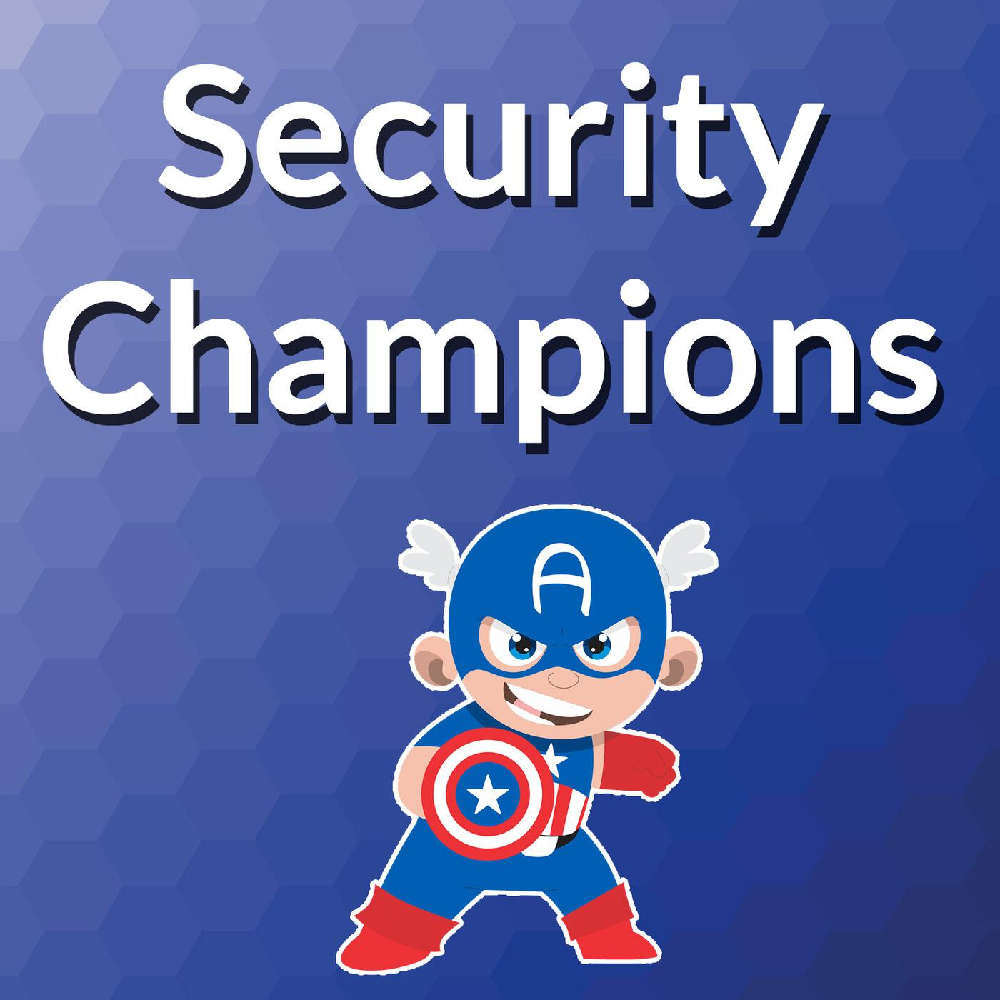

# SlimFixTheCodes

A laborator for learning secure web application and mobile application in a practical way. 😆

also This lab help us to learn fix the vulnerable codes and use SAST & DAST Pipeline to release secure application

How secure is my new code?

After mitigating a vulnerability, you can send a Pull Request to gently ask the SlimFixTheCodes community to review your new secure codes. If you're feeling a bit lost, try having a look at this mitigation solution, it might help! 🚀

## If you want to please read CONTRIBUTION.md

                                	          \|||/                                               
                   .-.________               (o o)              ________.-.                    
              ----/ \_)_______)  +------------(_)-----------+  (_______(_/ \----               
                 (    ()___)     |      SlimFixTheCodes     |     (___()     )                  
                      ()__)      |                          |      (__()                        
              ----\___()_)       |	                      |       (_()___/----                
                                 +------------Ooo-----------+                                
                                                                                      

                                                                                 