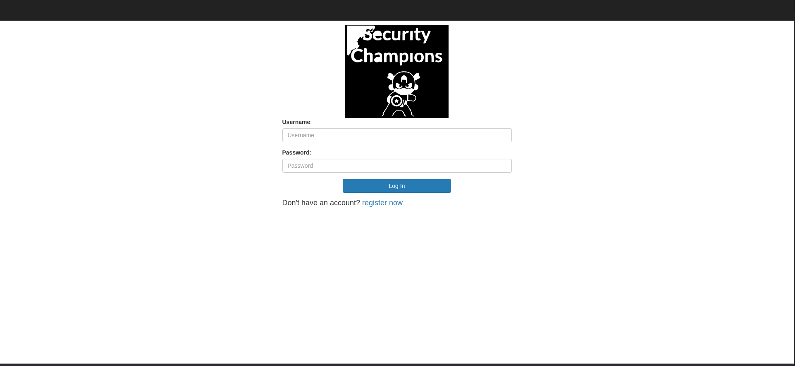

# Spring-Boot-Actuator


simple spring boot app that contains an example of misconfigured acuator and its main goal is to describe how a malicious user could exploit it on this purposefully vulnerable app.

## What is Actuator ?

In essence, Actuator brings production-ready features to our application. Monitoring our app, gathering metrics, understanding traffic, or the state of our database become trivial with this dependency.

Baeldung : https://www.baeldung.com/spring-boot-actuators


## Setup

You can start the application with one of these methods
1. Go into the src directory and run these commands :
```
1- ./gradlew build

2- ./gradlew bootRun
```

2. Or simply you can go into the docker directory and run following command:
```
docker-compose up -d
```

3. Or directly run it with docker like this:
```
docker run --name ssti -d -p 8080:8080 siyavash/actuator
```

Now visit [localhost:8080](http://localhost:8080)


## How To Exploit
After visiting [localhost:8080](http://localhost:8080) you must see a page like this:




### exploit exposed heapdump
to demonstrate this attack , we've created another user which will be login when the app starts.

1. Now register an account and login with it
2. You will be greeted by email address you've registered on previous step
3. visit following url and dump heapdump
```
http://localhost:8080/actuator/heapdump
```

4. Open downloaded file and search for `username=`, beside the username you've logged in with , you will find another username and password 
5. login with them and you will be greeted as victim

here is a video to show all the steps:
https://user-images.githubusercontent.com/9821568/156940898-633f46c8-9d94-49a0-ab62-494a070b2f1a.mp4


### exploit exposed shutdown

1. start the app .
2. send following curl command
```
curl -XPOST -v http://localhost:8080/actuator/shutdown
```

3. Application will be shutdown

here is a video to show all the steps:
https://user-images.githubusercontent.com/9821568/156940904-ff982b54-9415-4f13-a38c-b702df365301.mp4


## Twitter & Facebook Contributor :
   
 https://www.linkedin.com/in/mohammad-hussein-namadi-775baa131/
 
 https://www.linkedin.com/in/siavash-vaez-afshar-aa511060/
    
## Fix 

We encourage you to contribute to Project and Fix Codes

If you want to pull request please follow this :

CONTRIBUTION.md
 
## Reports
1. https://hackerone.com/reports/914719
2. https://hackerone.com/reports/862589
3. https://hackerone.com/reports/838635
4. https://hackerone.com/reports/783360
5. https://hackerone.com/reports/1019367
6. https://hackerone.com/reports/1022048

## Resources
1. https://www.acunetix.com/vulnerabilities/web/spring-boot-actuator/
2. https://book.hacktricks.xyz/pentesting/pentesting-web/spring-actuators
3. https://www.baeldung.com/spring-boot-actuators
